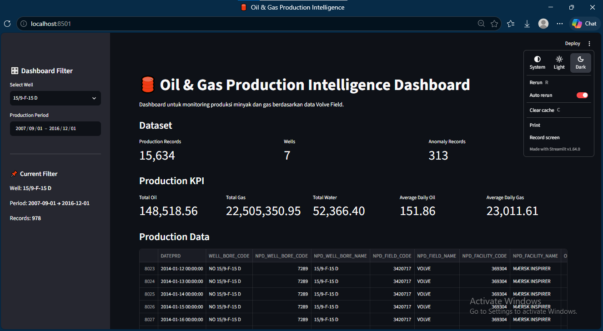

# 🛢️ Oil & Gas Production Intelligence Dashboard

Interactive dashboard untuk monitoring dan analisis produksi minyak dan gas berdasarkan data Volve Field.

Project ini dibuat sebagai portfolio Data Science untuk menunjukkan kemampuan dalam data processing, exploratory data analysis, time-series analysis, anomaly detection, dan data visualization menggunakan Python dan Streamlit.

## 📊 Project Overview

Dashboard digunakan untuk menganalisis performa produksi berdasarkan:

- Oil Production
- Gas Production
- Water Production
- Well Performance
- Production Trend
- Production Anomaly
- Anomaly Rate
- Production vs Anomaly Monitoring

Dashboard menyediakan filter interaktif berdasarkan:

- Well
- Production Period

Sehingga pengguna dapat melakukan analisis pada seluruh well maupun well tertentu dalam periode waktu yang dipilih.

## 🎯 Objectives

Project ini bertujuan untuk:

1. Menganalisis tren produksi minyak dan gas.
2. Membandingkan performa produksi antar well.
3. Mengidentifikasi periode yang memiliki anomaly.
4. Menampilkan hubungan antara produksi dan anomaly.
5. Membuat dashboard interaktif yang dapat digunakan untuk monitoring data produksi.

## 📁 Dataset

Dataset yang digunakan berasal dari data produksi **Volve Field**.

Data yang digunakan dalam dashboard meliputi:

- Production data
- Well KPI
- Anomaly report
- Monthly production
- Anomaly by well

Data telah melalui proses data cleaning dan preprocessing sebelum digunakan dalam dashboard.

## 🛠️ Tech Stack

- Python
- Pandas
- NumPy
- Plotly
- Streamlit
- Scikit-learn
- DuckDB

## 📸 Dashboard Preview



## 📈 Dashboard Features

### 1. Production KPI

Menampilkan ringkasan produksi berdasarkan filter yang dipilih:

- Total Oil Production
- Total Gas Production
- Total Water Production
- Average Oil Production
- Average Gas Production

### 2. Production Trend

Visualisasi tren produksi dari waktu ke waktu untuk:

- Oil
- Gas
- Water

### 3. Well Performance

Membandingkan performa produksi antar well.

### 4. Anomaly Monitoring

Menampilkan:

- Total anomaly
- Affected wells
- Anomaly rate
- Anomaly by well
- Detail anomaly

### 5. Production vs Anomaly

Menampilkan hubungan antara produksi dan periode anomaly menggunakan visualisasi interaktif.

## 🗂️ Project Structure

```text
Oil-Gas-Production-Intelligence/
│
├── app.py
├── requirements.txt
├── .gitignore
├── README.md
│
├── data/
│   ├── volve_production_clean.csv
│   ├── volve_well_kpi.csv
│   ├── volve_anomaly_report.csv
│   ├── volve_anomaly_by_well.csv
│   └── volve_monthly_production.csv
│
└── assets/
    └── dashboard.png